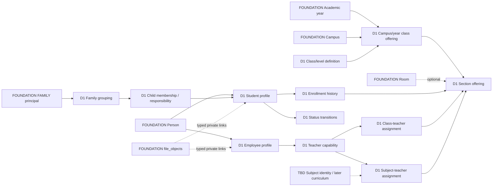

# Domain package 01 (D1A) — conceptual entity map

**Status legend:** **CONFIRMED** = product requirement; **SELECTED D1A** = proposed boundary for review, not SQL; **PROPOSED** = implementation-facing concept needing D1B validation; **TBD** = decision gate; **DEFERRED** = later package. Labels below are *concept names*, not approved tables, types, keys or enums. [Entity design template](DATABASE_ENTITY_DESIGN_TEMPLATE.md) governs later physical review.

Every independent candidate has a stable conceptual identity and an expected version for mutable commands; FK shape, exact uniqueness, indexes, types and policy code belong to D1B. All retained histories distinguish effective time from recorded time and attribute verified principals. Ordinary hard deletion is excluded. `app_private` remains hidden and any future exposed read surface must be narrowly reviewed.

| Candidate / authority | Purpose, identity and relationships | Lifecycle, history and retention | Security, workflow, audit, files, offline and example query |
|---|---|---|---|
| **Academic level/class definition — SELECTED D1A** | Stable, configurable school class/level concept with school-defined code, label and display order; not a fixed Play Group–Grade 12 enum. Anchored to Foundation school profile. Exact distinction between level and class is **TBD**. | Draft/active/archive proposed. A referenced definition remains for prior-year enrollment; label/order corrections need audit. | Academic administration only; archive cannot reassign a historic enrollment. No file; offline read cache may be versioned. Query: list current selectable classes while still naming a prior cohort. |
| **Campus/year class offering — SELECTED D1A** | The occurrence of a class definition in a Foundation campus and academic year; separates reusable catalog identity from year-specific availability and ordering/policy. | Planned/open/closed/archived proposed; prior offerings remain queryable. | Protect create/change with campus/year scope and audit; no client reparenting. Query: was Grade X offered at campus C in year Y? |
| **Section offering — SELECTED D1A** | Section within a class offering, with school-defined label/order; optionally links a Foundation room. Section identity is year/campus-bound, not a globally reused letter. | Open/closed/archive proposed; room may change by controlled effective assignment if history matters. Existing enrollments keep old section identity. | Section/campus administration. Source for capacity and class-teacher assignment; room capacity is distinct from enrollment cap. Query: current and historical section roster. |
| **Capacity policy/override evidence — PROPOSED** | Section/class offering limit and any explicit override authorization with actor, reason, affected enrollment, policy/version and decision. Exact level, count and approval rule **TBD**. | Effective revisions and exceptional decisions retained; do not erase an earlier limit to explain a past over-cap placement. | Elevated complete grant, possible approval, immutable/minimized audit; serialized allocation. No file unless approved evidence purpose. Offline allocation is server-only. Query: why was a 31st student admitted? |
| **Roll allocation policy/evidence — PROPOSED** | Configurable sequence start or authorized manual roll assignment, tied to an enrollment scope. No MAX-plus-one. Roll is not Student ID or admission number. Scope **TBD**. | Preserve assigned roll with placement history; corrections retain prior value and collision evidence. | Protected server allocator, idempotent command, audit; offline request cannot self-assign final roll. Query: roll roster for section/year. |
| **Student profile — SELECTED D1A** | Student identity linked to one Foundation Person, with school-facing Student ID, admission number/serial and admission date as distinct concepts. Demographics and contact fields are classified in D1B. Age/current placement are derived. | Profile survives all years and terminal statuses; sensitive corrections retain history. No cascade from Person/Auth. | Student administration and narrowly projected family/student self views; typed sensitive-correction workflow; `student.created`/`student.profile_corrected` candidate events. Profile photo or identity document links use private `file_objects` and approved purposes. Limited encrypted offline view; versioned correction. Query: who is student ID S and what can this viewer see? |
| **Student status transition — SELECTED D1A** | Separate authoritative change record with student, old/new state, effective date, reason and actor. Candidate states follow spec: Active, Graduated, Transferred, Suspended, Withdrawn, Expelled, Deceased, Alumni; exact transition matrix **TBD**. | Append transitions; current status derived or controlled projection. Record backdated correction without erasing prior knowledge. | Elevated status-change command and possible approval; `student.status_changed`; sensitive reason hidden from generic roster. Server-only offline replay. Query: status at date D and when the school learned it. |
| **Enrollment/placement spell — SELECTED D1A** | Authoritative association of student with Foundation year/campus plus class and section offering, roll, effective interval, enrollment state, reason and links to source/resulting placement where needed. Student status is separate. | Initial enrollment creates first spell; promotion/repeat creates new year spell; section/class/campus transfer ends an old spell and creates a new spell; withdrawal ends placement; re-enrollment creates a new spell. No in-place progression. Exact parallel-enrollment rule **TBD**. | Protected command validates ancestry, capacity, status, conflict and both old/new scopes; `enrollment.created`, `.promoted`, `.transferred`, `.corrected` are candidate events. Offline move is conflict-sensitive. Query: student's path through all years or active roster on a given date. |
| **Family/household identity — SELECTED D1A** | Domain grouping for linked children; shared FAMILY principal is the Foundation credential/actor and references this grouping through a controlled relationship. It is not another Person or Auth user. | Retain grouping/link history; disabling access does not delete children or evidence. | FAMILY may have Parent/Guardian only and only proven child visibility; `family.child_linked`/`.unlinked` candidates. No staff grants through an adult. Query: which children can this shared credential currently access? |
| **Child membership and responsible-adult relationship — SELECTED D1A** | Student-to-family link plus Father/Mother/Guardian responsibility/display metadata; adult Person link is optional only if the real adult exists as a canonical Person. Relationship-specific contact may be retained only when it differs from canonical Person data and has a clear disclosure purpose. | Effective links and revocation history; no silent reassignment of family access. Exact multiplicity/interval/authority rule **TBD**. | Typed link/unlink with independent authorization and audit, perhaps approval for contested changes; sensitive contact projection. Offline access changes server-only. Query: who was responsible for child S at time D? |
| **Employee profile — SELECTED D1A** | Employee identifier and employment facts linked to Foundation Person. Person may also be student's relative. Department/designation depth **TBD**; salary/payroll excluded. | Retain employment state/spells and reasons; ending employment does not erase teaching/audit history. | HR-scoped profile changes, restricted fields, `employee.created`/`.status_changed` candidates. Photo/documents use approved private purpose. Offline sensitive view only by current scope. Query: active staff at campus C, without payroll disclosure. |
| **Teacher capability — SELECTED D1A** | Employee qualification/eligibility as teacher, not another person, Auth binding or unrestricted role. Independent of actual class/subject assignments. | Effective eligibility changes retained; end invalidates new teaching operations. | Staffing command + audit; does not alone authorize marks or attendance. Query: is employee E eligible for teaching assignment at date D? |
| **Class-teacher assignment — SELECTED D1A** | Employee/teacher assigned responsibility for a section offering in campus/year and effective interval. Section relationship is explicit; exact cardinality **TBD**. | End and replace assignment rather than overwrite. Historical duty remains queryable. | Admin command verifies teacher eligibility and target context; `teaching.class_assignment_created`/`.ended` candidates. No automatic attendance/marks permission. Offline assignment writes server-only. Query: class teacher of section S on D. |
| **Subject-teacher assignment — SELECTED boundary, physical target TBD** | Employee/teacher assigned to a subject in a section offering/year/campus for an effective interval. Subject identity source depends on the subject/curriculum gate. One teacher may span multiple subjects, sections, classes and campuses. | Preserve assignments/ends/corrections; interval overlaps need explicit rule. | Context for SUBJECT/ASSIGNED resolver, never a complete grant by itself; `teaching.subject_assignment_created`/`.ended` candidates. Query: eligible teacher for subject X, section S, time D. |
| **Subject identity, curriculum assignment, optional selection, assessment component — TBD/DEFERRED** | Stable subject identity may be in D1 or later; class/year curriculum, elective selection and assessment rules are distinct later concepts. | Do not create placeholder identity merely to complete an ERD. | See [TBD gate](../decisions/DOMAIN_PACKAGE_01_TBD_GATE.md); no active SUBJECT resolver without authoritative source. |

The event names above are candidate lower-case dotted domain vocabulary consistent with Foundation's `identity.binding_changed`; final registered event types, payload version/redaction and consumer rules are D1B/D1C decisions. Do not emit an event for every trivial field. Approval uses Foundation's typed operation/target/result integration; direct table writes remain denied.

## Conceptual relationship view

Solid labels show existing Foundation anchors; `D1` labels are candidates only. No Mermaid name implies a SQL table.

