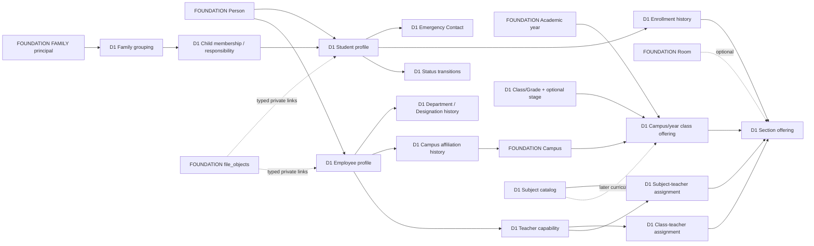

# Domain package 01 (D1A) — conceptual entity map

**Status legend:** **APPROVED D1B0** = [product-owner decision](../decisions/DOMAIN_PACKAGE_01_APPROVED_DECISIONS.md); **SELECTED D1A** = conceptual boundary; **PROPOSED** = implementation-facing concept needing physical review; **DEFERRED** = later package. Labels are *concept names*, not approved tables, types, keys or SQL enums. [Entity design template](DATABASE_ENTITY_DESIGN_TEMPLATE.md) governs D1B.

Every independent candidate has a stable conceptual identity and an expected version for mutable commands; FK shape, exact uniqueness, indexes, types and policy code belong to D1B. All retained histories distinguish effective time from recorded time and attribute verified principals. Ordinary hard deletion is excluded. `app_private` remains hidden and any future exposed read surface must be narrowly reviewed.

| Candidate / authority | Purpose, identity and relationships | Lifecycle, history and retention | Security, workflow, audit, files, offline and example query |
|---|---|---|---|
| **Class/Grade definition — APPROVED D1B0** | One stable, configurable operational Class/Grade identity with school-defined code, label and display order; not a fixed Play Group–Grade 12 enum. Optional stage/category (Early Years, Primary etc.) is classification metadata, never mandatory hierarchy. Anchored to Foundation school profile. | Draft/active/archive proposed. A referenced definition remains for prior-year enrollment; label/order corrections need audit. | Academic administration only; archive cannot reassign a historic enrollment. No file; offline read cache may be versioned. Query: list selectable classes while still naming a prior cohort. |
| **Subject catalog — APPROVED D1B0** | Stable authoritative school-configurable Subject identity. Section-specific teacher assignments refer to it, not free-text subject labels. | Retain referenced subjects after archive; new assignments cannot use archived subjects. | Academic catalog administration, audited changes; no curriculum grant inferred. Query: resolve Subject identity for a section teacher. |
| **Campus/year class offering — SELECTED D1A** | The occurrence of a class definition in a Foundation campus and academic year; separates reusable catalog identity from year-specific availability and ordering/policy. **CONFIRMED:** enrollment against this offering must respect class capacity; exact physical field location is D1B work. | Planned/open/closed/archived proposed; prior offerings remain queryable. | Protect create/change with campus/year scope and audit; no client reparenting. Query: was Grade X offered at campus C in year Y, and was it full? |
| **Section offering — SELECTED D1A** | Section within a class offering, with school-defined label/order; optionally links a Foundation room. Section identity is year/campus-bound, not a globally reused letter. Required section capacity accompanies required class-offering capacity. | Open/closed/archive proposed; room may change by controlled effective assignment if history matters. Existing enrollments keep old section identity. | Section/campus administration. Source for class-teacher assignment; room capacity is distinct from enrollment cap. Query: current and historical section roster. |
| **Class/section capacity and override evidence — APPROVED D1B0** | Both class-offering and section limits are authoritative; accepted enrollment satisfies both unless school policy permits explicit override. Record actor, reason, affected placement and audit. | Effective revisions and exceptional decisions retained; do not erase earlier limits explaining over-cap placement. | Explicit complete action grant, not role name; no approval solely for override. Atomic/concurrency-safe enforcement, no offline self-allocation. Query: which limit was overridden, by whom and why? |
| **Roll allocation policy/evidence — APPROVED D1B0** | School Owner configures academic-context versus persistent-student numeric roll. Initial five-digit numeric space defaults to `10000`, with configurable start. Numeric allocation is authoritative; contextual formatted display is derived. Roll is not Student ID or admission number. | New academic-context placement may receive new allocation; persistent mode retains student numeric component across years. Authorized manual adjustment preserves prior value/collision evidence. | Protected server allocator, idempotent and concurrency-safe, audit; never `MAX()+1`. Offline request cannot self-assign final roll. Query: roster display and underlying allocation for section/year. |
| **Student profile — SELECTED D1A** | Student identity linked to one Foundation Person; Student-domain permanent school-unique ID is allocated at Student creation, and permanent Admissions number is received at successful handoff. Admission serial, internal UUID and roll are distinct. An applicant is not yet a Student. Age/current placement are derived. | Profile survives all years and terminal statuses; sensitive corrections retain history. Neither Student ID nor admission number is reused. No cascade from Person/Auth. | Student administration and field-limited family/student self reads by ROSTER/PROFILE/RESTRICTED IDENTITY/SENSITIVE-SPECIAL class; typed correction workflow; `student.created`/`student.profile_corrected` candidate events. Private photo/document links use approved `file_objects` purposes. Encrypted offline view; versioned correction. Query: who is Student ID S and which fields can this viewer see? |
| **Student status transition — APPROVED D1B0** | Separate authoritative change record with student, old/new state, effective date, reason, actor, recorded timestamp and audit. States: Active, Suspended, Withdrawn, Transferred, Graduated, Expelled, Deceased, Alumni. | Append transitions; Suspended may return Active, Withdrawn/Transferred may re-enroll, Deceased terminal; no normal reactivation from Graduated/Expelled/Deceased. Alumni preserves Graduation history. Privileged factual correction retains prior knowledge. | Elevated status-change command and reviewed workflow; `student.status_changed` candidate; sensitive reason hidden from generic roster. Server-only offline replay. Query: status at date D and when school learned it. |
| **Enrollment/placement spell — APPROVED D1B0 cardinality** | Authoritative PRIMARY association of student with Foundation year/campus plus class and section offering, roll, effective interval, enrollment state, reason and source/resulting placement link. At most one normal active PRIMARY placement per Student at a time. Student status is separate. | Initial enrollment creates first spell; promotion/repeat creates new year spell; section/class/campus move ends old spell and creates new one; withdrawal ends placement; re-enrollment creates a new spell. No in-place progression. Special programs/electives use separate later assignments. | Protected command validates ancestry, both capacities, status, overlap and both old/new scopes; `enrollment.created`, `.promoted`, `.transferred`, `.corrected` candidates. Offline move is conflict-sensitive. Query: student's path through all years or active roster on a date. |
| **Family/household identity — SELECTED D1A** | Domain grouping for linked children; shared FAMILY principal is the Foundation credential/actor and references this grouping through a controlled relationship. It is not another Person or Auth user. | Retain grouping/link history; disabling access does not delete children or evidence. | FAMILY may have Parent/Guardian only and only proven child visibility; `family.child_linked`/`.unlinked` candidates. No staff grants through an adult. Query: which children can this shared credential currently access? |
| **Child membership and responsible-adult relationship — APPROVED D1B0** | Student may belong to multiple family/guardian groupings; one current primary/responsible display context. Father/Mother/Guardian metadata may reference an existing adult Person, but relationship fact and portal-access membership are separate. | Effective relationship intervals and revocation/end history are reconstructable; historically true relationship may remain after portal access ends. | FAMILY principal needs an authorized current/appropriate membership; adult Person link itself grants nothing. Typed link/revoke with audit, field-limited contact read. Offline access changes server-only. Query: who was responsible at D versus who can see child now? |
| **Emergency Contact — APPROVED CORE** | Separate Student relationship, optionally referencing an existing Person, with relationship/contact metadata; not a Family membership or guardian principal. | Preserve contact changes/effective history. | Does not grant FAMILY portal or child-record access; restricted contact read and audited protected changes. No custody/court-order/pickup workflow implied. Query: authorized emergency contact at date D. |
| **Employee profile — SELECTED D1A** | Employee identifier and employment facts linked to Foundation Person. Person may also be student's relative. Configurable Department/Designation and campus affiliation are separate historical relationships; salary/payroll/contracts excluded. | Retain employment state/spells and reasons; ending employment does not erase teaching/audit history. | HR-scoped profile changes, restricted fields, `employee.created`/`.status_changed` candidates. Photo/documents use approved private purpose. Offline sensitive view only by current scope. Query: active staff at campus C, without payroll disclosure. |
| **Department and Designation catalogs / employment assignment — APPROVED D1B0** | School-configurable organizational/job identities and effective-dated Employee associations. Neither is an authorization role. | Retain prior department/designation and employment changes. | Changing title or department grants no permission; HR-scoped change/audit. No salary, payroll or contract fact. Query: employee's designation at date D. |
| **Employee Campus Affiliation — APPROVED D1B0** | Effective-dated operational relationship of an Employee to one or more Foundation campuses, independent of teaching assignment and permission campus scope. | Retain affiliation start/end and prior campuses. | Affiliation alone grants no attendance, marks, Finance, HR or student access; complete grant/context still required. Query: employee's operational campuses at D. |
| **Teacher capability — SELECTED D1A** | Employee qualification/eligibility as teacher, not another person, Auth binding or unrestricted role. Independent of actual class/subject assignments. | Effective eligibility changes retained; end invalidates new teaching operations. | Staffing command + audit; does not alone authorize marks or attendance. Query: is employee E eligible for teaching assignment at date D? |
| **Class-teacher assignment — SELECTED D1A** | One designated class-teacher responsibility per section offering at a given effective time. A teacher may hold separate class-teacher assignments for multiple sections when authorized. | End and replace assignment rather than overwrite; no overlapping current class-teacher responsibility for the same section. Historical duty remains queryable. Simultaneous co-class-teachers require a later approved change. | Admin command verifies teacher eligibility and target context; `teaching.class_assignment_created`/`.ended` candidates. Assignment alone grants no attendance/marks permission. Offline assignment writes server-only. Query: class teacher of section S on D. |
| **Subject-teacher assignment — APPROVED D1B0** | Section-specific employee/teacher assignment to authoritative D1 Subject in section/year/campus with explicit PRIMARY, CO_TEACHER or SUBSTITUTE kind. Different sections may use different teachers; teacher may span subjects/sections/classes/campuses. | Normally one active PRIMARY per Subject+section; CO_TEACHER is explicit, SUBSTITUTE time-bounded. End/correct with history; accidental overlapping PRIMARY assignments prohibited. Employee active state and teacher eligibility interval must fit. | Context for SUBJECT/ASSIGNED resolver, never a complete grant by itself; `teaching.subject_assignment_created`/`.ended` candidates. Query: who can act for Subject X in section S at D, including substitute interval? |
| **Curriculum assignment, optional selection and assessment components — DEFERRED** | Later Academic Operations binds class/year curriculum and student elective selections to D1 Subject; exams own components/passing rules. | No curriculum-version mechanics in D1. | Do not infer Subject offering from catalog membership alone. |

The event names above are candidate lower-case dotted domain vocabulary consistent with Foundation's `identity.binding_changed`; final registered event types, payload version/redaction and consumer rules are D1B/D1C decisions. Do not emit an event for every trivial field. Approval uses Foundation's typed operation/target/result integration; direct table writes remain denied.

## Conceptual relationship view

Solid labels show existing Foundation anchors; `D1` labels are candidates only. No Mermaid name implies a SQL table.

