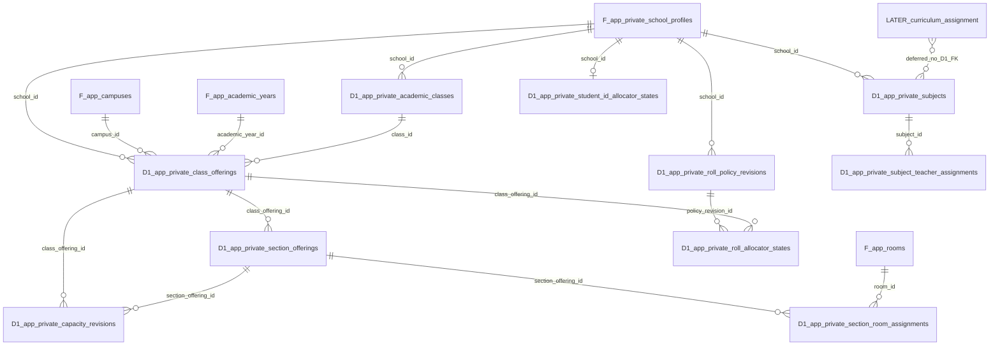
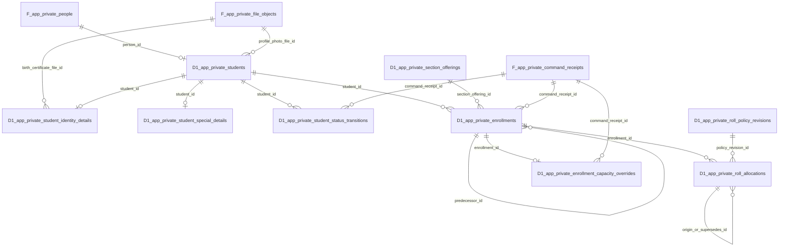
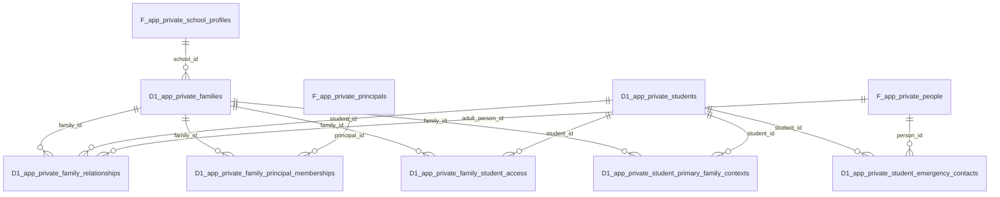
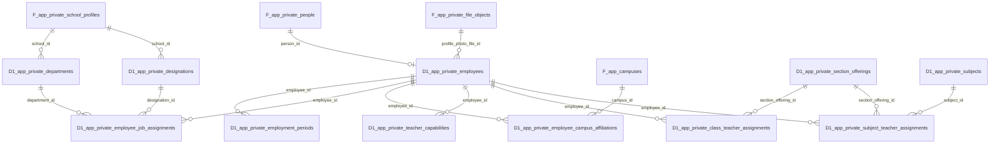

# D1B1 — proposed physical ERDs

**Documentation only; no SQL.** Every `app_private_X`/`app_X` Mermaid identifier spells the exact schema-qualified relation `app_private.X`/`app.X` with `.` replaced by `_` for Mermaid parsing. Prefix `F_` identifies an **existing frozen Foundation** relation; prefix `D1_` identifies a **proposed D1 physical** relation. `LATER_` is a deferred external package with **no D1 table or FK**. The exact column/FK list, including universal `created_by → app_private.principals(id)` on all 31 D1 relations, is in the [catalog](27_domain_package_01_physical_catalog.md) and [graph](28_domain_package_01_exact_dependency_graph.md). ERD lines show parent-to-child FKs; effective-time and non-FK ancestry checks require D1B2 review. There are zero new `app` base tables.

## 1. Academic Structure

The `capacity_revisions` two edges are alternatives: exactly one parent per row. `class_offerings.school_id` is consistency data; campus school equality needs protected validation because frozen campuses lack a composite key. `section_room_assignments` preserves room history, not timetable scheduling. `LATER_curriculum_assignment` is diagram context only.

## 2. Student and Enrollment

Student ID allocator has no FK to Student; it supplies an immutable school ID through the creation command. Admission Number comes from a later Admissions-owned handoff and is stored on Student with no premature FK. Roll allocation follows enrollment in the same protected transaction; formatted roll is derived. Year/campus/class derive from section → offering, not redundant enrollment fields. Nullable file FKs do not activate upload purpose.

## 3. Family and Emergency Contact

Relationship, principal-to-group link, child portal access and primary display are **four distinct physical facts**. None is a proxy FK for another. Emergency Contact has no edge to FAMILY principal or portal-access relations. Self `supersedes_id` references on history rows are enumerated in the graph.

## 4. Employee and Teaching

Teacher capability and ACTIVE employment are effective eligibility checks, not direct FKs from assignment rows to a particular interval; D1B2 must make race-safe validation explicit. Affiliation/job title gives no permission. Class-teacher and Subject-teacher histories are separate; Subject kind is a checked column, not three near-duplicate tables.

## 5. Combined cross-domain view

```mermaid
erDiagram
  F_app_private_school_profiles ||--o{ D1_app_private_academic_classes : school_id
  F_app_private_school_profiles ||--o{ D1_app_private_subjects : school_id
  F_app_private_school_profiles ||--o{ D1_app_private_class_offerings : school_id
  F_app_private_school_profiles ||--o{ D1_app_private_student_id_allocator_states : school_id
  F_app_private_school_profiles ||--o{ D1_app_private_roll_policy_revisions : school_id
  F_app_private_school_profiles ||--o{ D1_app_private_families : school_id
  F_app_private_school_profiles ||--o{ D1_app_private_departments : school_id
  F_app_private_school_profiles ||--o{ D1_app_private_designations : school_id
  F_app_campuses ||--o{ D1_app_private_class_offerings : campus_id
  F_app_academic_years ||--o{ D1_app_private_class_offerings : academic_year_id
  D1_app_private_academic_classes ||--o{ D1_app_private_class_offerings : class_id
  D1_app_private_class_offerings ||--o{ D1_app_private_section_offerings : class_offering_id
  D1_app_private_class_offerings ||--o{ D1_app_private_capacity_revisions : class_offering_id
  D1_app_private_section_offerings ||--o{ D1_app_private_capacity_revisions : section_offering_id
  D1_app_private_section_offerings ||--o{ D1_app_private_section_room_assignments : section_offering_id
  F_app_rooms ||--o{ D1_app_private_section_room_assignments : room_id
  D1_app_private_roll_policy_revisions ||--o{ D1_app_private_roll_allocator_states : policy_revision_id
  D1_app_private_class_offerings ||--o{ D1_app_private_roll_allocator_states : class_offering_id
  F_app_private_people ||--o| D1_app_private_students : person_id
  D1_app_private_students ||--o| D1_app_private_student_identity_details : student_id
  D1_app_private_students ||--o| D1_app_private_student_special_details : student_id
  D1_app_private_students ||--o{ D1_app_private_student_status_transitions : student_id
  D1_app_private_students ||--o{ D1_app_private_enrollments : student_id
  D1_app_private_section_offerings ||--o{ D1_app_private_enrollments : section_offering_id
  D1_app_private_enrollments ||--o{ D1_app_private_roll_allocations : enrollment_id
  D1_app_private_roll_policy_revisions ||--o{ D1_app_private_roll_allocations : policy_revision_id
  D1_app_private_enrollments ||--o| D1_app_private_enrollment_capacity_overrides : enrollment_id
  D1_app_private_families ||--o{ D1_app_private_family_relationships : family_id
  D1_app_private_students ||--o{ D1_app_private_family_relationships : student_id
  D1_app_private_families ||--o{ D1_app_private_family_principal_memberships : family_id
  F_app_private_principals ||--o{ D1_app_private_family_principal_memberships : principal_id
  D1_app_private_families ||--o{ D1_app_private_family_student_access : family_id
  D1_app_private_students ||--o{ D1_app_private_family_student_access : student_id
  D1_app_private_families ||--o{ D1_app_private_student_primary_family_contexts : family_id
  D1_app_private_students ||--o{ D1_app_private_student_primary_family_contexts : student_id
  D1_app_private_students ||--o{ D1_app_private_student_emergency_contacts : student_id
  F_app_private_people ||--o{ D1_app_private_student_emergency_contacts : person_id
  F_app_private_people ||--o| D1_app_private_employees : person_id
  D1_app_private_employees ||--o{ D1_app_private_employment_periods : employee_id
  D1_app_private_employees ||--o{ D1_app_private_employee_job_assignments : employee_id
  D1_app_private_departments ||--o{ D1_app_private_employee_job_assignments : department_id
  D1_app_private_designations ||--o{ D1_app_private_employee_job_assignments : designation_id
  D1_app_private_employees ||--o{ D1_app_private_employee_campus_affiliations : employee_id
  F_app_campuses ||--o{ D1_app_private_employee_campus_affiliations : campus_id
  D1_app_private_employees ||--o{ D1_app_private_teacher_capabilities : employee_id
  D1_app_private_employees ||--o{ D1_app_private_class_teacher_assignments : employee_id
  D1_app_private_section_offerings ||--o{ D1_app_private_class_teacher_assignments : section_offering_id
  D1_app_private_employees ||--o{ D1_app_private_subject_teacher_assignments : employee_id
  D1_app_private_section_offerings ||--o{ D1_app_private_subject_teacher_assignments : section_offering_id
  D1_app_private_subjects ||--o{ D1_app_private_subject_teacher_assignments : subject_id
  F_app_private_file_objects ||--o{ D1_app_private_students : profile_photo_file_id
  F_app_private_file_objects ||--o{ D1_app_private_student_identity_details : birth_certificate_file_id
  F_app_private_file_objects ||--o{ D1_app_private_employees : profile_photo_file_id
  F_app_private_command_receipts ||--o{ D1_app_private_enrollments : command_receipt_id
  F_app_private_command_receipts ||--o{ D1_app_private_capacity_revisions : command_receipt_id
  F_app_private_command_receipts ||--o{ D1_app_private_enrollment_capacity_overrides : command_receipt_id
  F_app_private_command_receipts ||--o{ D1_app_private_student_status_transitions : command_receipt_id
  LATER_admissions_allocator }o..o{ D1_app_private_students : deferred_handoff_no_FK
```

Universal actor FKs and same-relation predecessor/supersedes references are intentionally not drawn 31 times; their exact column-to-parent edges are in the graph and do **not** create a hidden inter-table cycle. The combined view is read with those explicit edges, not as a replacement for them. No deferred package is created here.
